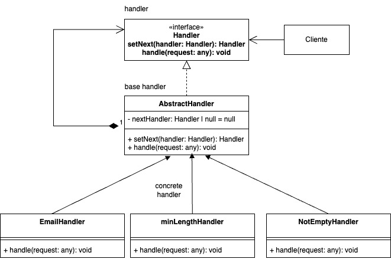

# Chain of responsability
   
es un patrón de diseño de comportamiento que permite pasar solicitudes a lo largo de una cadena de potenciales manejadores(handlers).
Al recibir una solicitud, cada manejador decide si procesar la solicitud o pasarla al siguiente controlador de la cadena

### Proposito

Este patrón es ideal para aplicaciones donde un cambio en el estado de un objeto necesita reflejarse automáticamente en otros objetos relacionados.

Por ejemplo:

- Un sistema de notificaciones.

- Actualización de la interfaz gráfica cuando cambian datos subyacentes.

### Estructura

- Handler (manejador): Define una interfaz común para procesar una solicitud o pasarla al siguiente manejador. Puede tener una referencia al siguiente manejador de la cadena

- Concrete Handler (manejador concreto): Implementan el procesamiento especifico para una solicitud. Decide si procesan la solicitud o la pasan al siguiente manejador en la cadena

- Cliente: inicia la solicitud

### Ventajas

- Flexibilidad para añadir o modificar manejadores en la cadena sin afectar a otros manejadores.

- Reduce el acoplamiento entre el emisor y los receptores de una solicitud.

- Actualizaciones automáticas: Cuando el estado del sujeto cambia, todos los observadores relevantes se actualizan automáticamente, lo que reduce errores manuales.

- Promueve el principio de diseño de "Open/Closed": El patrón permite que el sujeto esté abierto para extensiones (añadir observadores) pero cerrado para modificaciones.

- Flexibilidad en la cantidad de observadores: Se pueden registrar múltiples observadores dinámicamente en tiempo de ejecución.

### Desventajas

- Puede ser difícil seguir la lógica de ejecución si la cadena es larga.

- Si no se define un manejador por defecto, la solicitud podría no ser procesada.

### Ejemplo

Supongamos que tenemos un sistema para validar un formulario con varios campos. Cada campo requiere una validacion especifica, y queremos que cada validador sea responsable de su logica.

**Codigo** [`Chain of responsibility`](ChainOfResponsibility.ts)

