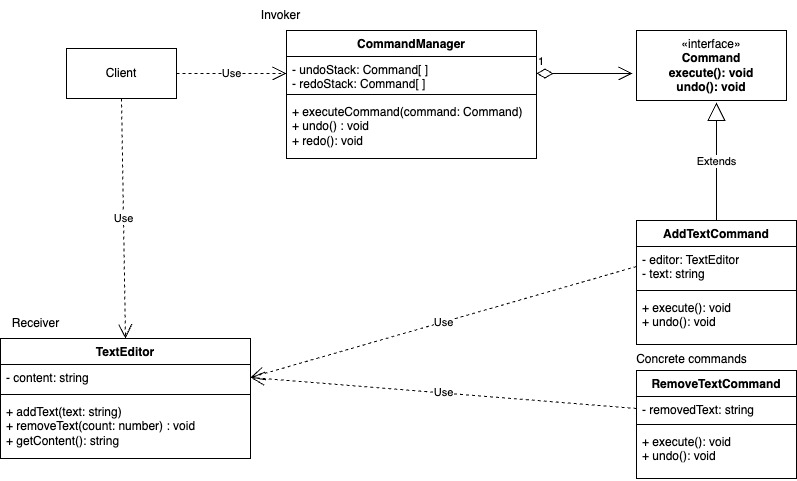

# Command
   
es uno de los patrones de comportamiento que permite encapsular una solicitud como un objeto, lo que facilita la parametrización de métodos con diferentes solicitudes, la encolación de solicitudes o el registro de las operaciones que se realizaron (historial de comandos).

### ¿Que problemas viene a solucionar?

- Acoplamiento entre el invocador y el receptor:
    - Problema: En sistemas sin Command, el invocador (quien emite la solicitud) está directamente acoplado al receptor (quien la ejecuta). Esto dificulta el mantenimiento y la reutilización del código.

    - Solución: El patrón Command desacopla estos dos componentes al introducir una capa intermedia (el comando). Esto permite que el invocador no tenga conocimiento directo del receptor. 

- Flexibilidad en la ejecución de comandos:
    - Problema: En sistemas tradicionales, agregar nuevas solicitudes o modificar las existentes puede requerir cambios en múltiples partes del codigo.
    - Solución: El patrón Command encapsula cada acción en un objeto independiente, lo que facilita agregar o cambiar comandos sin afectar otras partes del sistema.

- Ejecución diferida o encolada:
    - Problema: En algunos sistemas, las solicitudes necesitan ser almacenadas para ejecutarse mas tarde (por ejemplo, tareas programadas o trabajos en una cola).
    - Solucion: Los comandos se pueden serializar o almacenar en una cola para ejecutarse en el momento adecuado.

### Ventajas

- Desacoplamiento: Separa el emisor (Invoker) del receptor (Receiver).

- Extensibilidad: Es fácil añadir nuevos comandos sin cambiar el código existente.

- Flexibilidad: Permite almacenar y ejecutar comandos de forma dinámica.

- Historial: Habilita el registro de operaciones para permitir deshacer o rehacer.

### Desventajas

- Puede incrementar la complejidad del sistema al introducir múltiples clases.

- Requiere más código, especialmente si hay muchos comandos diferentes.

### Ejemplo

Sistema de deshacer (undo) y rehacer (redo). Este ejemplo simula un editor de texto donde se pueden agregar y eliminar texto, con la posibilidad de deshacer y rehacer las acciones.

**Codigo** [`Command`](./Command.ts)

