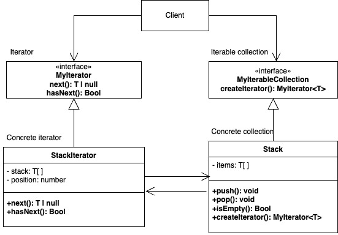

# Iterator
   
El patrón de diseño Iterator es un patrón de comportamiento que permite recorrer los elementos de una colección (como listas, pilas, arbol, etc.) sin exponer su representación interna. Este patrón abstrae la lógica de iteración en un objeto separado llamado iterador.

### Conceptos claves

- Iterador: Una interfaz que define métodos para acceder a elementos en una colección, típicamente:
    - hasNext(): Indica si hay más elementos por iterar.
    - next(): Devuelve el siguiente elemento.

- Colección: Una clase que implementa una interfaz para crear iteradores que recorren sus elementos.

- Cliente: Utiliza el iterador para recorrer los elementos de la colección sin preocuparse por su implementación interna.

### Ventajas

- Desacopla la lógica de recorrido de la colección.

- Permite recorrer diferentes estructuras de datos de manera uniforme.

- Facilita la implementación de diferentes tipos de iteración (por ejemplo, hacia adelante, hacia atrás).

### Ejemplo

implementacion de un ejemplo simple donde recorremos una pila que almacena numeros

**Codigo** [`Iterator`](./Iterator.ts)

