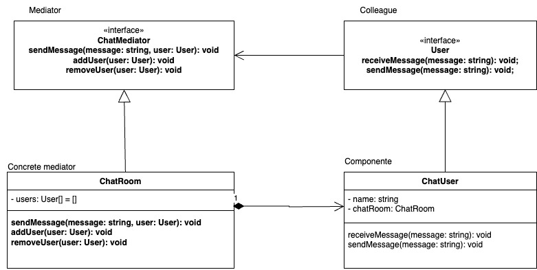

# Mediator
   
Es un patron de diseño que define un objeto, el mediador, para centralizar la comunicacion entre varios componentes u objetos en un sistema. Esto desacopla las clases al evitar interacciones directas entre objetos/componentes, haciendo que se comuniquen a traves de el mediator lo que facilita la mantenibilidad y flexibilidad en la arquitectura del sistema

El patron mediator permite:

- Encapsular la lógica de comunicación en un solo lugar

- Desarrollar componentes más independientes y autónomos

- Facilitar la integración de nuevos componentes o funcionalidades

- Mejorar la gestión de errores y excepciones

Es especialmente util en sistemas con:

- Muchos objetos interconectados

- Comunicaciones complejas entre componentes

- Requisitos de escalabilidad y flexibilidad

- Necesidad de reducir el acoplamiento entre objetos

### Componentes

- Mediator: Es el objeto intermediario que gestiona la comunicación entre los objetos Colleague.

- Colleague: Son los objetos que se comunican entre sí a través del Mediator.

### Ventajas

- Reduce el acoplamiento entre objetos.

- Simplifica la comunicación entre objetos.

- Facilita la escalabilidad y mantenimiento del sistema.

### Desventajas

- Puede crear un punto único de fallo.

- La complejidad del Mediator puede aumentar rápidamente.

### Ejemplo

Supongamos que estamos creando un sistema de chat en tiempo real. Queremos que los usuarios puedan enviar mensajes y que estos se muestren en tiempo real para todos los usuarios conectados.

**Codigo** [`Mediator`](./Mediator.ts)

