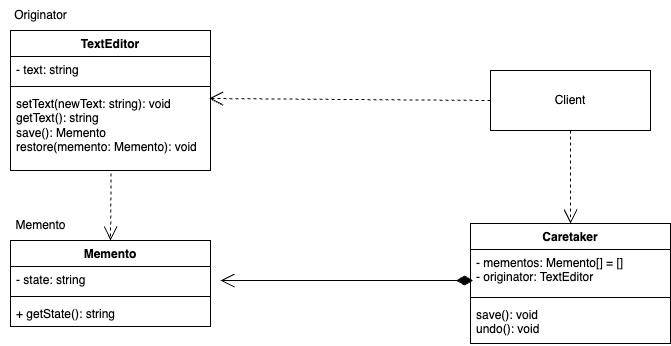

# Mediator
   
El patrón de diseño Memento es un patrón de comportamiento que permite capturar y restaurar el estado interno de un objeto sin violar su encapsulación. dando la posibilidad de deshacer (undo) o rehacer (redo) cambios hecho al objeto

### Componentes

- Originator:

    - El objeto cuyo estado queremos guardar y restaurar.

    - Tiene métodos para crear y restaurar mementos.

- Memento:
    
    - Es un objeto que almacena el estado interno del Originator.

    - Es accesible solo para el Originator (debería ser inmutable desde fuera).

- Caretaker:

    - Es el encargado de almacenar los mementos.
    - No interactúa directamente con el estado del Originator, solo guarda y utiliza los mementos para restaurar estados.

### Ejemplo

Supongamos que queremos implementar una aplicación de texto simple con funcionalidad para deshacer cambios.

**Codigo** [`Memento`](./Memento.ts)

