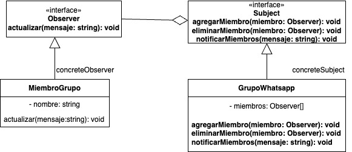

# Observer
   
es un patrón de diseño de comportamiento que define una relación de dependencia uno a muchos entre objetos. Permite que cuando un objeto cambie de estado, todos sus dependientes (observadores) sean notificados automáticamente.

### Proposito

Este patrón es ideal para aplicaciones donde un cambio en el estado de un objeto necesita reflejarse automáticamente en otros objetos relacionados.

Por ejemplo:

- Un sistema de notificaciones.

- Actualización de la interfaz gráfica cuando cambian datos subyacentes.

### Estructura

- Subject (Sujeto): Mantiene una lista de observadores y proporciona métodos para agregar, eliminar y notificar a los observadores.

- Observer (Observador): Define una interfaz para recibir actualizaciones del sujeto.

- ConcreteSubject (Sujeto Concreto): Implementa las funcionalidades del sujeto y almacena el estado que interesa a los observadores.

- ConcreteObserver (Observador Concreto): Mantiene una referencia al sujeto e implementa la interfaz Observer para mantenerse sincronizado con el sujeto.

### Ventajas

- Desacoplamiento entre el Subject y los Observers: El sujeto no necesita conocer los detalles de implementación de los observadores. Solo sabe que implementan la interfaz Observer.

- Facilidad para añadir nuevos observadores: Se pueden agregar nuevos observadores sin modificar el código del sujeto, lo que mejora la extensibilidad del sistema.

- Actualizaciones automáticas: Cuando el estado del sujeto cambia, todos los observadores relevantes se actualizan automáticamente, lo que reduce errores manuales.

- Promueve el principio de diseño de "Open/Closed": El patrón permite que el sujeto esté abierto para extensiones (añadir observadores) pero cerrado para modificaciones.

- Flexibilidad en la cantidad de observadores: Se pueden registrar múltiples observadores dinámicamente en tiempo de ejecución.

### Desventajas

- Complejidad en sistemas grandes: Con muchos observadores, el sistema puede ser más difícil de rastrear y depurar, especialmente si ocurren bucles de notificaciones.

- Rendimiento reducido: Si hay muchos observadores o las actualizaciones son frecuentes, el rendimiento del sistema puede degradarse debido a múltiples notificaciones.

### Ejemplo

En un grupo de WhatsApp, cada miembro del grupo es un observador, mientras que el grupo en sí actúa como el sujeto. Cuando un miembro del grupo envía un mensaje, todos los demás miembros (observadores) son notificados automáticamente.

**Codigo** [`Observer`](./Observer.ts)

