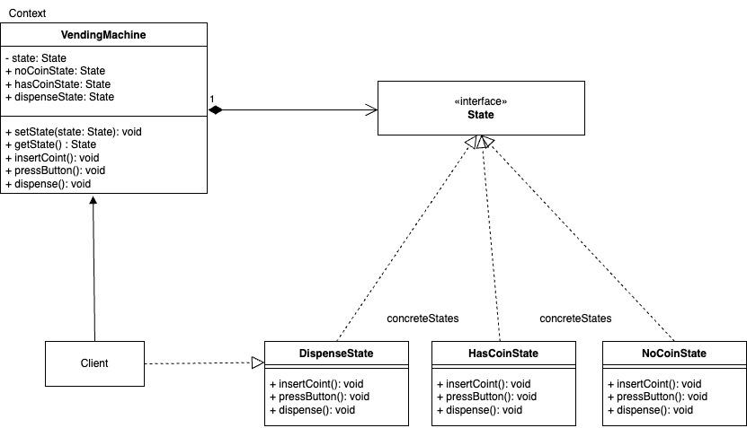

# State
   
El patrón de diseño State es un patrón de comportamiento que permite a un objeto modificar su comportamiento dinámicamente en función de su estado interno. En lugar de utilizar estructuras condicionales como if o switch para manejar los diferentes estados, el patrón encapsula los comportamientos asociados a cada estado en clases separadas. El objeto principal delega sus operaciones a estas clases específicas de estado y puede cambiar entre ellas en tiempo de ejecución según su estado actual, proporcionando un diseño más flexible y mantenible.

### Conceptos clave

- Contexto (context):

    - Es el objeto principal que contiene una referencia al estado actual.

    - Permite cambiar el estado actual en tiempo de ejecución.

- Estado (State):
    
    - Una interfaz o clase base que define el comportamiento común de todos los estados.

- Estados concretos (concrete states):

    - Implementaciones específicas de la interfaz del estado.

    - Cada clase concreta define un comportamiento particular asociado con un estado.

### Ejemplo

- Vamos a modelar una máquina expendedora con tres estados:
    - Sin monedas
    - Con monedas
    - Producto entregado

Cuando se inserta una moneda, cambia al estado "Con moneda". Luego, al presionar el botón, cambia al estado "Producto entregado"

**Codigo** [`State`](./State.ts)

