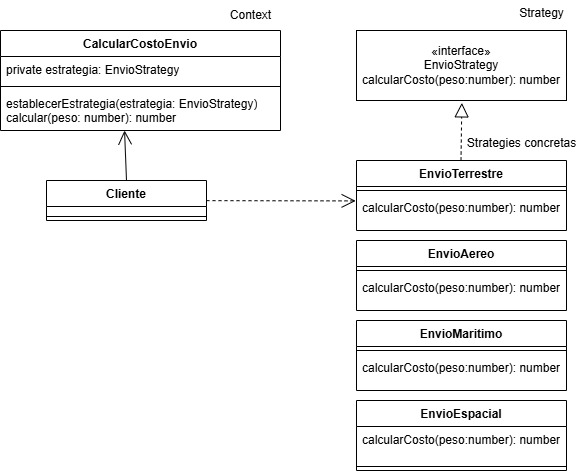

# Strategy
   
El patrón Strategy es un patrón de diseño de comportamiento que te permite definir una familia de algoritmos, encapsularlos en clases separadas y hacer que sean intercambiables en tiempo de ejecución. Este patrón promueve el principio de "abierto/cerrado" ya que puedes agregar nuevas estrategias sin modificar el código que las utiliza.

La idea principal detrás del patrón Strategy es separar el comportamiento que puede variar del resto del código que no cambia. Esto se logra encapsulando las distintas maneras de realizar una tarea en clases independientes (estrategias) y permitiendo que el cliente elija cuál usar en tiempo de ejecución.

### ¿Que es el principio abierto/cerrado?

Es uno de los principios fundamentales de diseño de software dentro de los Principios SOLID. Este principio establece que:

"Las entidades de software (clases, módulos, funciones) deben estar abiertas para extensión, pero cerradas para modificación."

Esto significa que deberías poder extender el comportamiento de una clase o módulo sin tener que modificar su código fuente existente. Este enfoque ayuda a prevenir la introducción de errores en código ya probado y mejora la mantenibilidad del sistema.

### ¿Por que usar el patron strategy?

En lugar de hacer que una clase tenga demaciados condicionales para manejar diferentes métodos, el patrón Strategy permite enviar el cálculo a una clase externa especializada haciendo el codigo mas legible y facil de escalar

### ¿Cuando utilizar el patron strategy?

- Cuando tienes múltiples algoritmos, comportamientos o métodos para realizar una operación, como cálculos, validaciones, transformaciones, etc.

- Cuando existen estructuras condicionales repetitivas

- Cuando quieres cambiar el comportamiento de un objeto en tiempo de ejecución sin alterar su estructura interna.

### Ventajas

- Flexibilidad: puedes agregar o cambiar estrategias sin modificar el contexto.

- Reutilización: las estrategias son clases independientes que pueden reutilizarse en diferentes contextos.

- Cumple con el principio de responsabilidad única: cada estrategia se encarga de un cálculo específico.

### Desventajas

- Complejidad: aumenta el número de clases en el sistema.

- Requiere diseño inicial claro: es más útil si se espera que haya múltiples algoritmos o comportamientos intercambiables.

### Ejemplo

Imaginemos que queremos calcular el costo de envío dependiendo del método de transporte (terrestre, aéreo o marítimo),  si implementamos esto sin el patron strategy nos quedaria un if === tipoTransporte por cada tipo de transporte que tengamos, lo que presentaria varios problemas principalmente la complejidad de escalar nuestro sistema, acoplamiento y violacion del principio abierto/cerrado.

**Codigo** [`Strategy`](./Strategy.ts)

