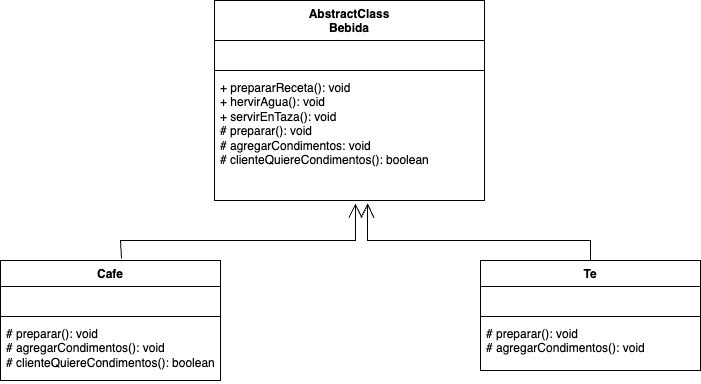

# Template Method
   
El patrón de diseño Template Method es un patrón de comportamiento que define el esqueleto de un algoritmo en una clase base y permite que las subclases redefinan ciertos pasos del algoritmo sin cambiar su estructura general.

### Caracteristicas clave

- Clase base con el esqueleto del algoritmo: La clase base contiene un método (el "template method") que define la secuencia de pasos del algoritmo. Este método puede llamar a otros métodos definidos en la clase base o ser implementados por las subclases.

- Pasos del algoritmo: Algunos pasos del algoritmo se implementan en la clase base, mientras que otros se dejan como métodos abstractos o "ganchos" para que las subclases los personalicen.

- Evita duplicación de código: Al definir la estructura general en la clase base, se reduce la duplicación de código al reutilizar la lógica común entre diferentes implementaciones.

### Ventajas

- Reutilización de código: La estructura general del algoritmo se define una vez y puede reutilizarse con diferentes implementaciones.

- Control de flujo: La clase base controla el flujo del algoritmo, asegurando consistencia.

- Fácil personalización: Las subclases pueden personalizar pasos específicos sin alterar la lógica global.

### Desventajas

- Complejidad inicial: Puede ser excesivo si el algoritmo es sencillo o si hay pocos pasos que varían.

- Fuerte acoplamiento: Las subclases dependen de la clase base, lo que puede dificultar cambios en la estructura del algoritmo.

### Ejemplo

Imaginemos que queremos implementar un sistema para preparar diferentes tipos de bebidas calientes como té y café. Ambas bebidas siguen un proceso similar, pero tienen pasos específicos que las distinguen.

**Codigo** [`TemplateMethod`](./TemplateMethod.ts)

