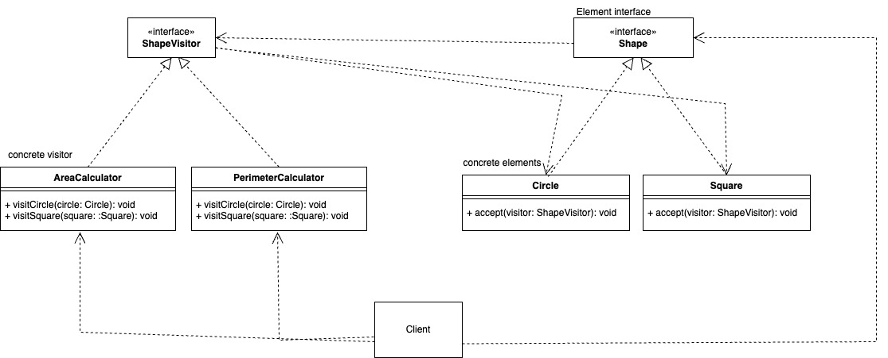

# Visitor
   
El patrón de diseño Visitor pertenece a los patrones de comportamiento. Su propósito es separar un algoritmo de la estructura de datos en la que opera, lo que permite añadir nuevas operaciones sin cambiar las clases de los elementos sobre los que se aplica.
Este patrón es útil cuando:

- Frecuentemente se añaden nuevas operaciones a un conjunto de clases.

- Quieres mantener la lógica de las operaciones separada de las estructuras de datos.

### Caracteristicas clave

- Visitor (Visitador): Define una interfaz para todas las operaciones que pueden realizarse en los elementos de una estructura.

- ConcreteVisitor (Visitador Concreto): Implementa las operaciones específicas.

- Element (Elemento): Define una interfaz que acepta un objeto visitador.

- ConcreteElement (Elemento Concreto): Implementa el método accept que delega la operación al visitador.

- ObjectStructure (Estructura de Objetos): Mantiene una colección de elementos y permite que un visitador recorra todos ellos.

### Ventajas

- Extensibilidad: Se pueden agregar nuevas operaciones (visitadores) sin modificar las clases de los elementos.

- Separación de responsabilidades: La lógica de las operaciones está separada de las clases de los elementos.

### Desventajas

- Dificultad para agregar nuevos elementos: Si necesitas agregar nuevas clases de elementos, todas las implementaciones de Visitor deben modificarse.

- Puede hacer que el código sea más complejo si tienes muchos elementos y visitadores.

### Ejemplo

Supongamos que estamos modelando una jerarquía de figuras geométricas (como Círculo y Cuadrado) y queremos calcular el área y perímetro de cada figura utilizando el patrón Visitor.

**Codigo** [`Visitor`](./Visitor.ts)

