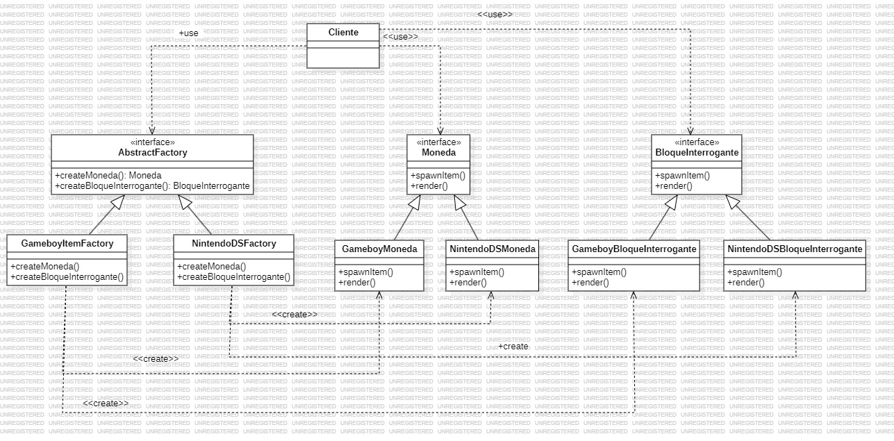

# Abstract Factory
   
Su definición: "Patrón de diseño que provee una interficie para crear familias de objetos relacionados o dependientes sin especificar su clase concreta"

El patrón Abstract Factory es un patrón de diseño creacional que permite crear familias de objetos relacionados o dependientes sin especificar sus clases concretas. En lugar de instanciar los objetos directamente, el cliente interactúa con una interfaz de fábrica abstracta que se encarga de producir los objetos, lo cual permite que el cliente cambie fácilmente entre familias de productos sin alterar su propio código.

### Problema en el cual el patron factory no es la mejor opcion y abstract factory si

Supongamos que estás desarrollando una aplicación multiplataforma que necesita diferentes componentes de interfaz de usuario para macOS y Windows. Estos componentes podrían incluir botones, ventanas, menús, etc., y cada sistema operativo tiene su propio estilo.

Con Factory Method, puedes crear una fábrica que devuelva un tipo de botón (por ejemplo, MacButton o WindowsButton), pero no tienes una manera eficiente de agrupar y gestionar la creación de múltiples componentes relacionados de una misma familia (por ejemplo, MacButton, MacWindow, MacMenu para macOS, o WindowsButton, WindowsWindow, WindowsMenu para Windows).
Cada vez que quieras añadir un nuevo tipo de componente (por ejemplo, un menú), necesitarás actualizar o crear nuevas fábricas para cada uno de los componentes en ambos sistemas operativos.

### ¿Por qué usar el patrón Abstract Factory?

- Creación de Familias de Objetos Relacionados: Abstract Factory es ideal cuando necesitas crear grupos de objetos relacionados o dependientes (familias) sin especificar sus clases concretas. Esto es común en aplicaciones que funcionan en múltiples entornos o plataformas, como UI multiplataforma.

- Consistencia entre Productos: Cuando los objetos en una familia deben funcionar juntos o seguir un estilo específico, Abstract Factory asegura que los productos sean compatibles y consistentes entre sí. Por ejemplo, los botones, menús y ventanas en un sistema operativo deben compartir un estilo visual.

- Desacoplamiento del Código: Con Abstract Factory, el cliente no necesita saber qué clase específica está usando para crear un objeto; solo conoce la interfaz de la fábrica y los productos. Esto reduce la dependencia de las clases concretas, mejorando la modularidad y facilitando cambios de implementación.

- Facilidad para Expandir y Mantener el Código: Agregar una nueva "familia" o grupo de objetos es sencillo; solo tienes que implementar una nueva fábrica sin alterar el código de los clientes. Esto es mucho más eficiente que actualizar múltiples métodos o clases cada vez que se necesita una nueva variante.

