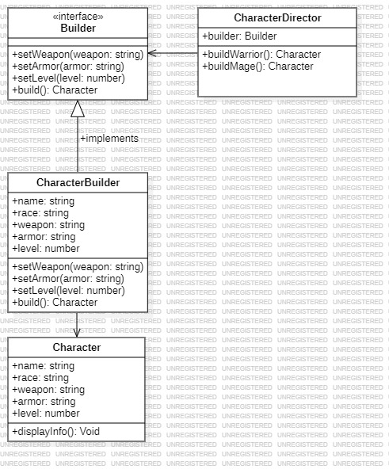

# Builder
   
El patrón Builder es un patrón de diseño creacional que se usa para construir objetos complejos paso a paso. A diferencia de los constructores tradicionales, el patrón Builder permite una construcción más flexible y controlada del objeto final, especialmente cuando tiene múltiples atributos opcionales o configurables.

### ¿Por qué usar el patrón prototype?

- Flexibilidad en construcción: Permite crear objetos complejos paso a paso y configurar solo las partes necesarias.

- Código más limpio: Evita constructores largos y sobrecargados con múltiples parámetros opcionales.

- Código más limpio: Evita constructores largos y sobrecargados con múltiples parámetros opcionales.

- Encapsulación: La lógica de construcción está oculta dentro del Builder y Director, manteniendo el código del cliente más simple.

Un ejemplo seria por ejemplo la creación de un computador donde tiene multiples piezas que se pueden personalizar para distintos tipos de usos segun sus piezas;

