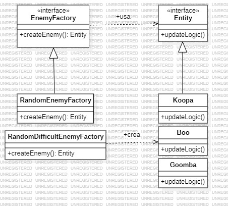

# Factory Method
   
El patrón Factory es un patrón de diseño creacional que proporciona una forma de crear objetos sin especificar la clase exacta de objeto que se va a crear. En lugar de instanciar objetos directamente con el operador new, el patrón Factory delega esta tarea a un método o clase especial llamada "fábrica". Esto permite que el código sea más flexible y fácil de extender.

### ¿Por qué usar el patrón Factory?

- Desacoplamiento: El patrón Factory permite que el código que usa los objetos no dependa de las clases específicas de esos objetos. Esto significa que puedes cambiar las implementaciones de esos objetos sin tener que modificar el código que los utiliza.

- Facilidad para agregar nuevas clases: Si necesitas agregar una nueva clase que sigue el mismo contrato (interfaz o clase base), solo tienes que añadirla a la fábrica sin modificar el código que llama a la fábrica.

- Organización: Agrupa en un solo lugar la lógica de creación de objetos complejos o basados en condiciones, haciendo el código más fácil de mantener y entender.

- Control sobre la creación de objetos: Si la creación de ciertos objetos requiere lógica adicional, como configurar estados o inicializar parámetros, la fábrica encapsula estos pasos.

