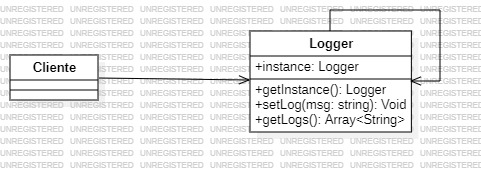

# Builder
   
El patrón Singleton es un patrón de diseño que asegura que solo haya una única instancia de una clase en toda la aplicación. Además, proporciona un punto de acceso global para obtener esa instancia.

### ¿Como funciona?

- Control de Instancia Única: La clase Singleton se asegura de que, cuando alguien pida una instancia de esta clase, siempre reciba la misma.

- Punto de acceso global: Como solo hay una instancia, siempre accedes a ella desde un método específico que la clase ofrece (por ejemplo, getInstance()).

### Ventajas

- Ahorra memoria: Al tener una única instancia, no estás creando varias copias de un objeto que debe ser único.

- Fácil acceso: Puedes acceder a la instancia de manera directa y global, sin importar desde dónde la necesites en tu código.

### Desventajas

- Dificultad para pruebas: Puede ser más difícil de probar, porque una vez que creas la instancia, es complicado reiniciar su estado o reemplazarla en pruebas.

### Ejemplo

**Codigo** [`Singleton`](./Singleton.ts)

