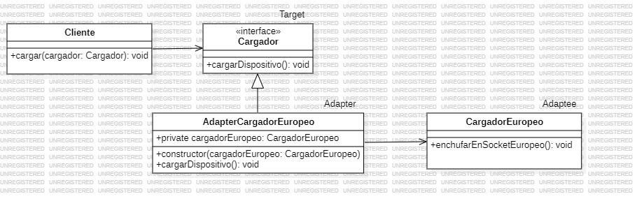

# Adapter
   
El patrón de diseño Adapter pertenece a los patrones estructurales y se utiliza para permitir que dos interfaces incompatibles trabajen juntas. Su objetivo principal es "adaptar" la interfaz de una clase existente para que sea compatible con otra interfaz que el cliente espera.

### Concepto clave

- Un Adapter actúa como un traductor entre dos clases o sistemas con interfaces distintas.

- Se puede utilizar cuando quieres que una clase existente funcione con otras clases sin modificar su código.

### Componentes principales

- Target (Objetivo): Define la interfaz esperada por el cliente.

- Adaptee (Adaptado): La clase que tiene la funcionalidad que quieres reutilizar pero con una interfaz incompatible.

- Adapter: Una clase que implementa la interfaz Target y traduce las llamadas del cliente al Adaptee

### Ejemplo práctico

Imaginemos que tenemos un sistema que trabaja con una clase que representa un cargador de dispositivos. Pero ahora necesitamos usar una clase con una interfaz diferente (por ejemplo, un cargador europeo). Utilizamos un adaptador para que ambas interfaces sean compatibles.

**Codigo** [`Adapter`](./Adapter.ts)

