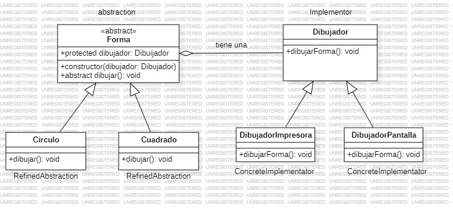

# Bridge
   
El patrón de diseño Bridge (o Puente) es un patrón estructural que tiene como objetivo desacoplar una abstracción de su implementación, de manera que ambas puedan variar de forma independiente. Es particularmente útil cuando tienes dos dimensiones que pueden cambiar en un sistema y deseas que esas variaciones sean gestionadas de manera separada.

### ¿Cuando utilizar el patron bridge?

- Quieres evitar una gran cantidad de subclases debido a combinaciones posibles de distintas variantes. 

- Necesitas dividir la implementación de una clase en clases independientes que puedan desarrollarse y evolucionar de forma separada.

### Componentes del patron bridge

- Abstracción (Abstraction): Define la interfaz general de la abstracción y contiene una referencia a un objeto de Implementación. La   abstracción actúa como puente que permite el acceso indirecto a la implementación.

- Implementación (Implementor): Es una interfaz o clase abstracta que define métodos específicos que la Abstracción puede utilizar. Estas implementaciones suelen ser específicas de la plataforma o funcionalidad.

- Refinación de la Abstracción (Refined Abstraction): Extiende la abstracción principal y puede agregar o modificar el comportamiento de la abstracción. Sin embargo, sigue usando la Implementación a través de la interfaz definida en Implementor.

- Implementaciones Concretas (ConcreteImplementor): Estas son implementaciones específicas que heredan de la interfaz Implementor. La abstracción utiliza estas implementaciones concretas para llevar a cabo acciones específicas.

### Ventajas

- Desacoplamiento: Permite que la abstracción y la implementación evolucionen de forma independiente

- Reducción de Subclases: Evita la explosión de subclases al combinar jerarquías en un sistema

- Mayor Flexibilidad: Puedes añadir nuevas implementaciones y abstracciones sin modificar el código existente

### Desventajas

- Complejidad Incrementada: Agrega complejidad debido a la creación de varias interfaces y clases.

- Dependencia en la Abstracción: Al depender de la abstracción para hacer el puente, hay que diseñarla adecuadamente para que soporte futuras implementaciones

### Ejemplo

**Codigo** [`Bridge`](./Bridge.ts)

