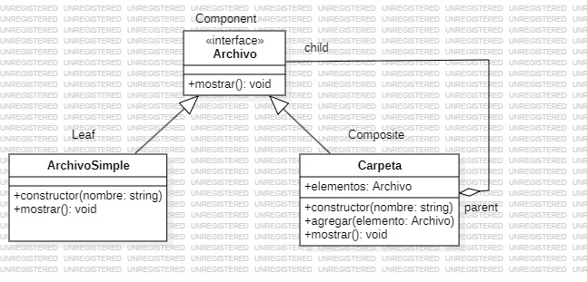

# Composite
   
El patrón de diseño Composite es un patrón estructural que se utiliza para tratar de manera uniforme objetos individuales y composiciones de objetos. Es particularmente útil cuando tienes una estructura jerárquica de objetos que puede tener una relación de "parte-todo" en la que un objeto es siempre, o una parte de un todo, o un todo compuesto por varias partes y necesitas manipular tanto los objetos compuestos como los individuales de la misma manera.

Basicamente se trata de establecer una jerarquia en forma de arbol, donde cada entidad puede estar formada por otras entidades del mismo tipo

### ¿Cuando utilizar el patron bridge?

- Hay una estructura jerárquica de objetos (por ejemplo, un árbol)

- Los clientes deben tratar los objetos individuales y los compuestos de forma uniforme.

- Necesitas realizar operaciones en un grupo de objetos de manera recursiva.

### Componentes del patron bridge

- Componente (Component): Es una interfaz común para todos los objetos de la composición. Define las operaciones que pueden realizar tanto los objetos individuales como los compuestos.

- Hoja (Leaf): Representa los objetos individuales en la composición que no tienen elementos hijos.

- Compuesto (Composite): Representa un objeto que tiene hijos. Implementa la interfaz del Componente y maneja los elementos hijos, delegando a ellos las operaciones.

### Ventajas

- Facilidad de uso: Permite a los clientes tratar a los objetos compuestos y los simples de manera uniforme.

- Flexibilidad: Agregar nuevos tipos de nodos o modificar la estructura es sencillo, ya que todos los elementos implementan la misma interfaz.

### Desventajas

- Puede hacer más compleja la implementación si hay reglas de validación específicas o restricciones sobre cómo se pueden combinar los objetos.

### Ejemplo

**Codigo** [`Composite`](./Composite.ts)

