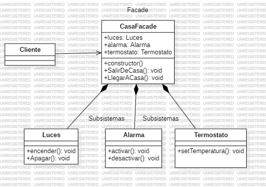

# Facade
   
El patrón de diseño Facade es un patrón estructural cuyo propósito es simplificar la interfaz de una biblioteca, framework o cualquier otro grupo complejo de clases. Este patrón proporciona una interfaz simple y más fácil de usar para un conjunto de interfaces en un subsistema complejo que contiene muchas partes, ocultando su complejidad y permitiendo que el cliente interactúe con el sistema de manera simplificada para trabajar con la funciones realmente importantes para el cliente.

### Contexto y uso

El patrón Facade es útil cuando un sistema tiene múltiples partes interdependientes que el usuario o cliente no necesita ver ni manipular directamente. Es común en sistemas grandes y complejos donde la interacción directa con todas las clases y módulos sería complicada o confusa.

### ¿Como funciona?

- Fachada: Una clase Facade proporciona métodos simplificados y específicos para realizar ciertas acciones, encapsulando y delegando tareas a varias clases del sistema.

- Subsistema: Las clases internas que forman parte del subsistema son complejas, y cada una tiene funcionalidades específicas y detalladas. La Facade se encarga de coordinar estas clases para ejecutar tareas complejas de forma sencilla.

### Beneficios

- Simplicidad: Proporciona una interfaz simple y fácil de usar para sistemas complejos.

- Desacoplamiento: Aísla el código cliente del subsistema, lo que facilita la modificación del sistema sin afectar al cliente

- Organización: Ayuda a organizar el sistema, creando una capa de abstracción sobre el subsistema.

### Ejemplo
Imagina que tienes un sistema para gestionar una casa inteligete y que cada elemento requiere su configuración y manejo. En lugar de que el cliente tenga que interactuar con el sistema por separado, puedes crear una clase centralizada que tenga métodos como play(), pause(), o stop(), que internamente llaman y coordinan a las clases individuales de audio, video y subtítulos.

**Codigo** [`Facade`](./Facade.ts)

