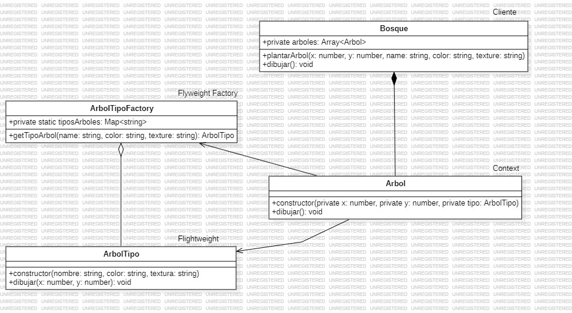

# Flyweight
   
El patrón Flyweight es un patrón estructural que busca minimizar el uso de memoria compartiendo tantos datos como sea posible entre los objetos que tienen estados similares o idénticos. Este patrón es ideal cuando necesitas manejar un gran número de objetos que comparten información común, pero también tienen datos únicos.

### Concepto clave

- Un Adapter actúa como un traductor entre dos clases o sistemas con interfaces distintas.

- Se puede utilizar cuando quieres que una clase existente funcione con otras clases sin modificar su código.

### Componentes principales

- Estado Intrínseco:
    1. Datos compartidos entre múltiples objetos, que son inmutables y no cambian.
    2. Almacenados en el Flyweight.

- Estado Extrínseco:
    1. Datos específicos de cada objeto, que pueden cambiar.
    2. Pasados desde el cliente al Flyweight cuando se realiza una operación.

- Factory:
    1. Responsable de administrar y reutilizar instancias de Flyweight. Evita crear múltiples objetos idénticos.

### Ejemplo práctico

Imagina que estamos desarrollando un juego donde se representan árboles en un bosque. Cada árbol tiene un tipo (estado intrínseco) y una posición (estado extrínseco).

Aquí usamos el patrón Flyweight para minimizar el uso de memoria cuando hay muchos árboles del mismo tipo.

### Cómo funciona el ejemplo

- TipoArbolFactory:
    1. Se asegura de que cada combinación única de ArbolTipo se cree solo una vez.
    2. Si ya existe un ArbolTipo con el mismo nombre, color, y textura, lo reutiliza.

- Arbol:
    1. Contiene la posición específica (estado extrínseco) y una referencia a un ArbolTipo (estado intrínseco).

- Memoria Optimizada
    1. Aunque hay múltiples árboles (Arbol), los datos compartidos (ArbolTipo) se almacenan solo una vez

**Codigo** [`Flyweight`](./Flyweight.ts)

