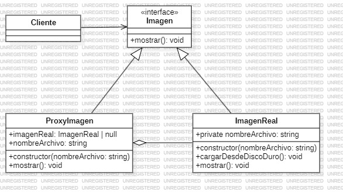

# Proxy
   
El patron de diseño Proxy es un patron estructural que proporciona un sustituto o representante de otro objeto para controlar el acceso a este. Se utiliza comúnmente para agregar una capa de control sobre el objeto real, ya sea por razones de rendimiento, control de acceso, o para realizar alguna acción adicional antes o después de acceder al objeto real

### Estructura del patrón proxy

- Interfaz común: Define los métodos que tanto el objeto real como el proxy deben implementar.

- Sujeto real (Real Subject): Es el objeto principal que se quiere proteger o representar.

- Proxy: Es la clase intermediaria que controla el acceso al sujeto real.

### Como funciona

Se crea una clase proxy con la misma interfaz que el sujeto real. Despues actualizas tu aplicación para que pase el objeto proxy a todos los clientes del objeto real. Al recibir una solicitud de un cliente, el proxy crea un objeto de sujeto real y le delega todo el trabajo

### Ventajas

- Control adicional: Permite añadir lógica antes y después de llamar al objeto real

- Mejor rendimiento: Puedes diferir la creación o ejecución de operaciones costosas.

- Organización: Permite implementar funcionalidades adicionales como caching, autenticacion o validación

El patron Proxy es una herramienta poderosa para estructurar sistemas que requiren control sobre el acceso a objetos, especialmente cuando se manejan recursos costosos o necesitas una capa de seguridad.

### Desventajas

- Mayor complejidad: introduce mas clases y abstracción

- Posibles problemas de rendimiento: Si no se gestiona bien el proxy puede añadir una sobrecarga innecesaria

### Ejemplo práctico

Supongamos que tenemos un sistema que carga imagenes y alguna imagenes son muy pesadas para volver a cargarlas. Podriamos utilizar un proxy para cargarlas cuando sea solamente necesario.

**Codigo** [`Proxy`](./Proxy.ts)

